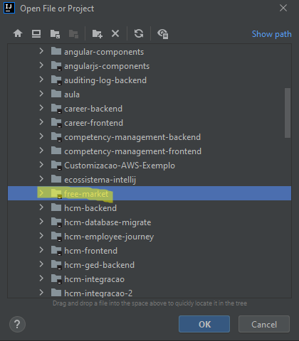
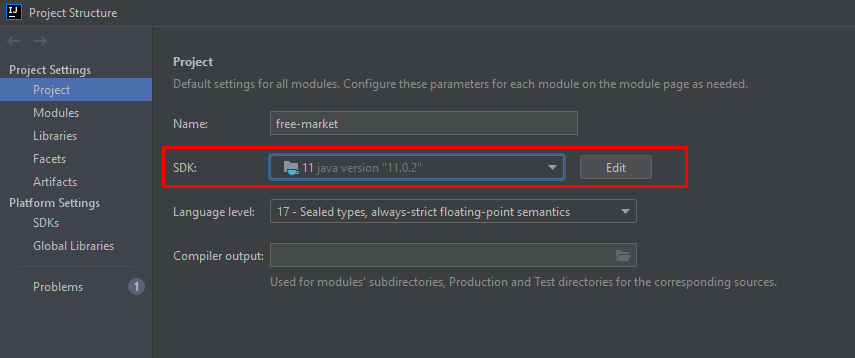
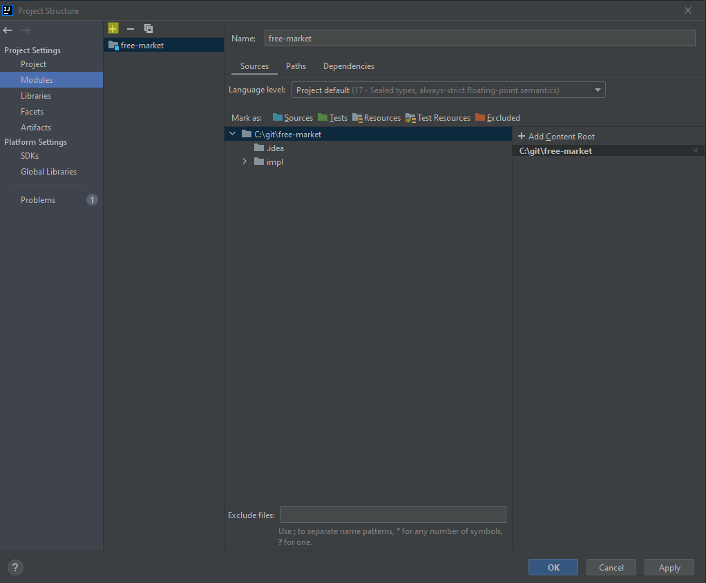
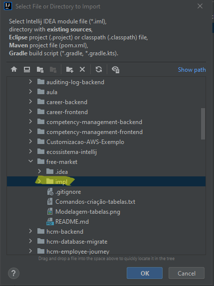
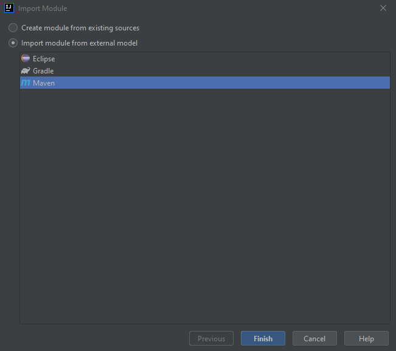
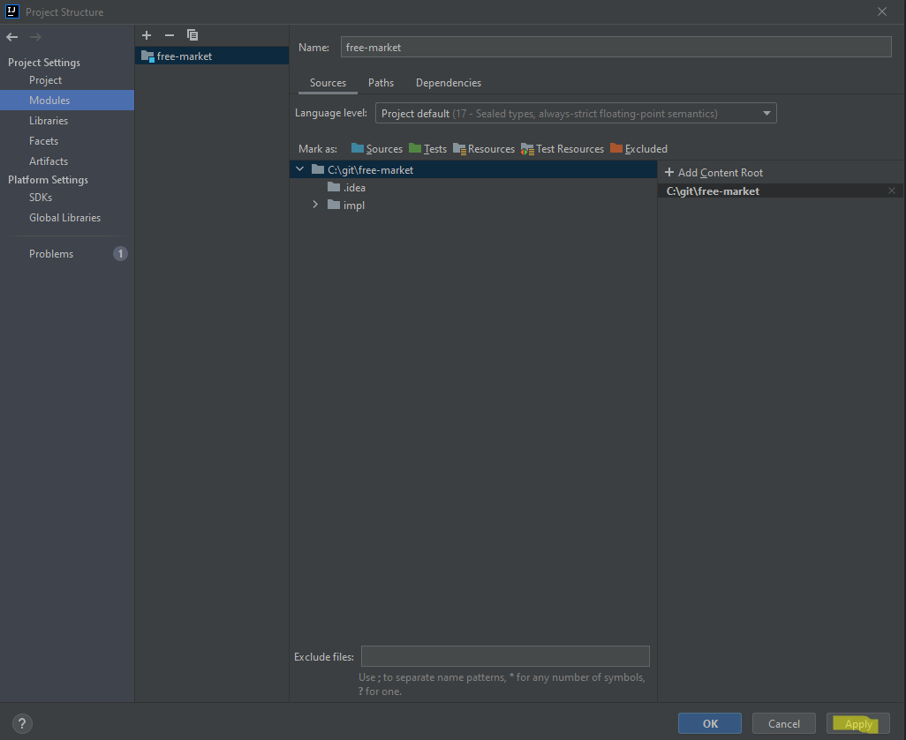

# Trabalho programação web

**Alunos:**
* Gabriel Kresin
* Iago Giuseppe Tambosi
* Johnny Andréas Schweder

---

### Objetivo do projeto:
Este trabalho tem como objetivo fornecer APIs para serem consumidas pelo projeto [frontend](https://github.com/Iagopeppe/Trabalho_2_Parte_2-Prog.WEB) da aplicação. 
A aplicação contém uma tela de login e um cadastro para usuários novos. Os usuários cadastrados podem anunciar produtos para serem vendidos dentro do site.

---

### Como importar o projeto (Intellij IDE):
1. Você pode fazer o download da IDE [aqui](https://www.jetbrains.com/pt-br/idea/download/#section=windows)
2. Após baixar e installar a IDE, inicie ela
3. Acesse a aba File > Open > Selecione a pasta do projeto
   
   
4. Acesse novamente a aba File > Project Structure e faça as seguintes configurações:
   1. Configure a SDK do projeto na aba Project
   
      
   
   2. Na aba Modules, importe o módulo impl do projeto clicando ícone +
   
      
   
   3. Selecione a pasta impl do projeto
   
      

   4. Importe como projeto maven e clique em finish
   
      
   
   5. Clique em apply
   
      
   
6. Após isso o projeto estará pronto para ser modificado através da IDE

---

### Pré-requisitos para executar o projeto:
* Possuir uma JDK 11 ou superior com o path configurado
* Deve possui o [maven](https://maven.apache.org/install.html) instalado e configurado
* Deve possuir uma base de dados postgres

---

### Como executar o projeto:
1. Antes de começar a rodar o projeto, é necessário configurar a base de dados postgres que o backend se conectará. Para isso, cria uma base de dados postgres com o nome freemarket e execute os comandos contidos no arquivo [Comandos-criacão-tabelas](Comandos-criação-tabelas.txt)
2. Com a base configurada, agora importe o projeto seguindo as etapas citadas acima
3. É possível executar o projeto através da classe App.java ou via linha de comando
   
**Linha de comando**:
   * Abra o terminal da IDE e digite os seguintes comandos:
   * `cd impl`
   * `mvn spring-boot:run`

---

### Testando os endpoints:
Para consumir/testar as APIs presentes no projeto, sugiro a utilização do software [Postman](https://www.postman.com/downloads/). 
[Importe](https://kb.datamotion.com/?ht_kb=postman-instructions-for-exporting-and-importing) a [collection](collection-freeMarket-apis.json) contida nos arquivos do projeto. Essa collection já possui uma requisição pré-configurada para cada API.
